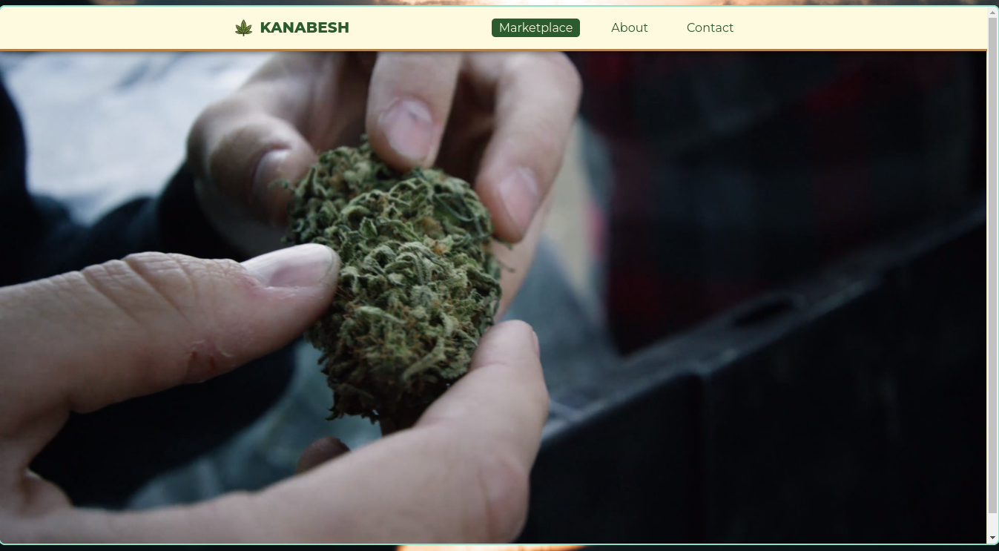

# :herb: Dashboard



## Table of Contents

- [HTML](#html)
- [CSS](#css)

### HTML

``` html
<!DOCTYPE html>
<html>
  <head>
    <meta charset="UTF-8" />
    <meta name="viewport" content="width=device-width, initial-scale=1" />
    <link rel="stylesheet" href="./css/dashboard.css" />
		<link rel="icon" href="./img/favicon.ico" />
    <title>KanaBesh</title>
  </head>
  <body>
    <nav>
      <div class="container">
        <h1 class="kanabesh"></a>KanaBesh</h1>

        <div class="menu">
          <a href="#" id="active">Marketplace</a>
          <a href="#">About</a>
          <a href="#">Contact</a>
        </div>

      </div>
    </nav>

    <video width="auto" height="748" autoplay muted>
      <source src="https://kush.com/blog/wp-content/uploads/2019/04/kush-com-video-background.mp4" type="video/mp4">
    </video>
  </body>
</html>
```

### CSS

``` css
@import url('https://fonts.googleapis.com/css?family=Montserrat:400,800');

:root {
  --brown: #B0814C;
  --bar: #FEFAE0;
  --fg: #2B5B2E;
}

* {
  margin: 0;
  padding: 0;
  box-sizing: border-box;
  font-family: 'Montserrat', sans-serif;
}

body {
  background-color: #E2DEC0;
}

h1 {
  color: var(--fg);
  font-size: 20px;
  font-weight: bold;
  letter-spacing: .1px;
  text-transform: uppercase;
}

.kanabesh {
  font-weight: bold;
}

.cannabis {
  float: left;
  height: 25px;
  margin: 0 10px 0 0;
}

.container {
  max-width: 700px;
  margin: 0 auto;
  display: flex;
  align-items: center;
  justify-content: space-between;
}

nav {
  position: fixed;
  top: 0;
  left: 0;
  right: 0;
  z-index: 99;
  background-color: var(--bar);
  padding: 16px 32px;
  border-bottom: 3px solid var(--brown);
  box-shadow: 0 1px 10px rgba(0,0,0,0.60);
}

.menu {
  display: flex;
  flex: 1 1 0%;
  justify-content: flex-end;
}

.menu a {
  color: var(--fg);
  margin: 0px 16px;
  font-weight: 100;
  text-decoration: none;
  transition: 0.3s;
  padding: 3px 10px;
  border-radius: 5px;
}

.menu a:hover {
  color: var(--bar);
  background-color: var(--fg);
}

#active {
  color: var(--bar);
  background-color: var(--fg);
}
```
